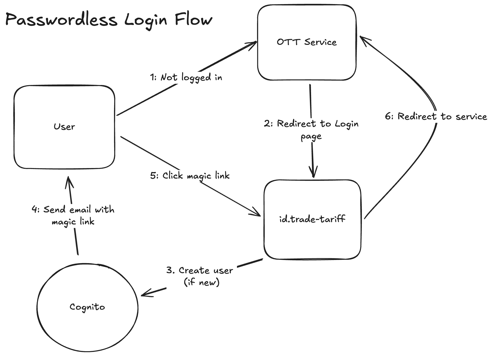

# identity

Ruby app providing interface to Cognito allowing users to be authenticated.

Initially this service exists to work with 1 consumer,
but allows for new consumers and new login methods to be added in the future.

Users email address will be stored securly in AWS Cognito. Once authenticated,
user details and access tokens are made available for a limited time to
consumers applications.

## Getting started

### AWS Locally

Add the following env variables to an `.env.development.local` file:

``` sh
COGNITO_USER_POOL_ID
COGNITO_CLIENT_ID
AWS_ACCESS_KEY_ID
AWS_SECRET_ACCESS_KEY
AWS_SESSION_TOKEN
```

As an alternative to using the AWS vars above,
you can login and set the AWS_PROFILE env var

``` sh
aws sso login --profile [profile name]
```

###

Start the app with

``` sh
bin/dev
```

Go to the [Login page](http://localhost:3005/myott)

## Passwordless Login

Shows how the login flow interacts with Cognito.



### Cognito JWT

When the user is redirected to the service, a Cognito JWT is set as a cookie
called `id_token` which contains the user's details. In non-development
environments the token is encrypted using `ENCRYPTION_SECRET`. This needs to
be shared with the consuming service.
